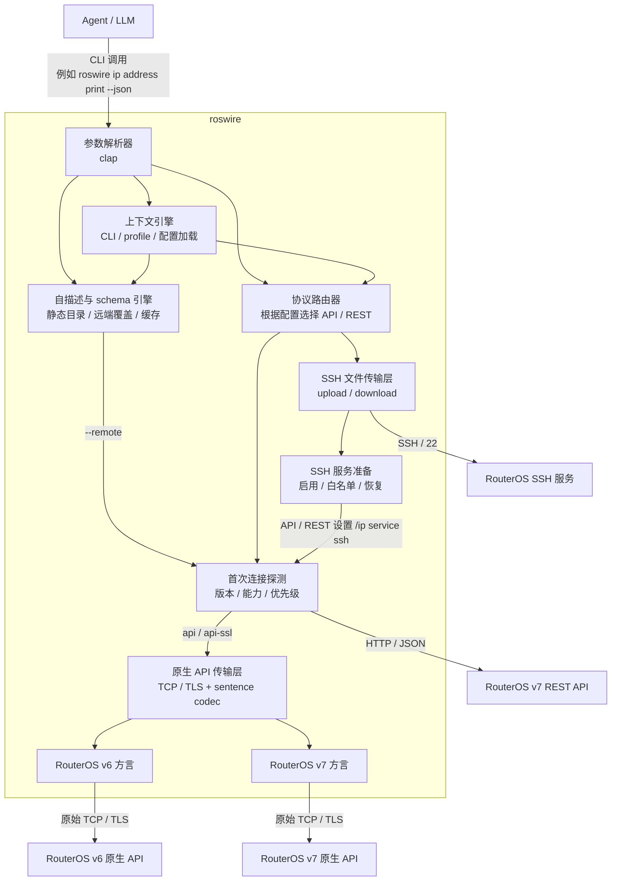

# roswire


[](https://www.rust-lang.org/)
[](LICENSE)

**语言 / Language:** 简体中文 | [English](README.md)

`roswire` 是一个轻量、JSON 优先的命令行桥接工具，面向需要操作 MikroTik RouterOS 设备的 **AI Agent** 与自动化脚本。

与面向人类交互的传统 CLI 不同，`roswire` 不输出颜色、加载动画（spinner）、分页器（pager），也不做交互式提问。它的契约很简单：成功结果写入 `stdout`，结构化错误和诊断信息写入 `stderr`。

> **项目状态：** 当前为 MVP / Beta 候选。核心 JSON-first CLI、配置、协议路由、自描述、SSH 文件传输、文件工作流和发布工程已经闭环；生产级稳定版仍受真机/CHR 矩阵阻塞。生产级门槛见 [`docs/production-readiness.md`](docs/production-readiness.md)，开发计划见 [`docs/develop-plan.md`](docs/develop-plan.md)。

## 核心特性

- **JSON 优先契约**：机器可读输出是 Agent 运行时和脚本集成的稳定接口。
- **严格流隔离**：`stdout` 只承载成功结果；`stderr` 承载错误、调试日志和诊断信息。
- **默认非交互**：缺少参数时直接返回结构化 JSON 错误，而不是等待用户输入。
- **协议与方言分层**：支持 RouterOS 原生 API（`8728`/`8729`）的 v6/v7 方言，以及 RouterOS v7 REST API。
- **单个原生二进制目标**：以一个 Rust 二进制文件发布，不要求 Node.js/Python/Go 等外部运行时。
- **便于 Agent 自我修正**：错误包含稳定错误码、脱敏上下文和可选修复提示。

## 安装

预编译二进制由 GitHub Releases 提供，并随 release 附带 `checksums.txt`。

Linux 快速安装：

```bash
curl -fsSL https://raw.githubusercontent.com/AS153929/roswire/main/scripts/install.sh | sh
```

安装脚本会识别 Linux x86_64 / arm64，下载匹配的 latest release 产物，校验 `checksums.txt`，并把 `roswire` 安装到 `/usr/local/bin`。如需固定版本或安装到用户目录：

```bash
curl -fsSL https://raw.githubusercontent.com/AS153929/roswire/main/scripts/install.sh | ROSWIRE_VERSION=v0.0.3 ROSWIRE_INSTALL_DIR="$HOME/.local/bin" sh
roswire doctor --json
```

如果本机已经安装 Rust，也可以在 crate 发布后通过 crates.io 安装：

```bash
cargo install roswire --locked
```

### Agent skill

本仓库还在 [`skills/roswire`](skills/roswire) 下提供可选的 `roswire` Agent skill，用于展示 AI Agent 如何发现 `roswire` 命令 schema、执行只读 RouterOS 证据采集，并安全总结 JSON 结果。这里安装的是 Agent skill；`roswire` 二进制仍需通过上面的方式单独安装。

查看本仓库可用的 skills：

```bash
npx skills add https://github.com/AS153929/roswire --list --full-depth
```

如果列表里出现 `roswire`，安装这个具体 skill：

```bash
npx skills add https://github.com/AS153929/roswire --skill roswire --full-depth
```

把 `roswire` skill 全局安装到所有支持的 Agent：

```bash
npx skills add https://github.com/AS153929/roswire --skill roswire --agent '*' --global --full-depth --yes
```

只安装到当前项目：

```bash
npx skills add https://github.com/AS153929/roswire --skill roswire --agent '*' --full-depth --yes
```

如果从本地 checkout 开发，在仓库根目录运行：

```bash
npx skills add . --skill roswire --agent '*' --global --full-depth --copy --yes
```

因为 skill 位于 `skills/roswire/`，而不是仓库根目录，所以需要 `--full-depth`。

手动安装、Cargo 安装说明、Windows PowerShell 校验、源码构建和卸载步骤见 [`docs/installation.md`](docs/installation.md)。维护者发布流程见 [`docs/release.md`](docs/release.md)。

## 快速开始

这条路径面向全新安装：先安装并检查本机环境，再创建一个 profile，把密码放在 shell history 之外，最后执行第一条只读 RouterOS 命令。

1. 安装并运行本地诊断

```bash
curl -fsSL https://raw.githubusercontent.com/AS153929/roswire/main/scripts/install.sh | sh
roswire doctor --json
```

`doctor` 默认只检查本机环境；只有传入 `--include-remote` 时才会访问 RouterOS。

1. 初始化本地配置

```bash
roswire config init --json
```

1. 创建并检查 RouterOS profile

```bash
roswire config device add studio \
  host=192.168.88.1 \
  user=admin \
  protocol=auto \
  routeros_version=auto \
  transfer=ssh \
  ssh_host_key=SHA256:replace-with-routeros-host-key \
  allow_from=203.0.113.10/32 \
  --json
roswire config profiles --json
roswire --profile studio config inspect --json
```

1. 保存密码，避免把明文写入 shell history

`env` secret 后端只在 `config.toml` 里保存环境变量名；secret 值保留在当前进程环境中。

```bash
read -rsp 'RouterOS password: ' ROSWIRE_STUDIO_PASSWORD; echo
export ROSWIRE_STUDIO_PASSWORD
roswire config secret set studio password type=env env=ROSWIRE_STUDIO_PASSWORD --json
```

生产环境优先使用可用的系统钥匙链或 encrypted secret 后端。先用平台钥匙链工具保存 secret，再只把引用写入 `roswire`：

```bash
roswire config secret set studio password type=keychain service=roswire account=profiles/studio/password --json
```

1. 执行第一条只读 RouterOS 命令

```bash
roswire --profile studio interface print --json
```

成功结果以结构化 JSON 写入 `stdout`；错误以单个结构化 JSON 对象写入 `stderr`。

## 常见任务

| 意图 | 命令 |
| --- | --- |
| 检查本机环境 | `roswire doctor --json` |
| 创建或检查 profile | `roswire config init --json`、`roswire config profiles --json`、`roswire --profile studio config inspect --json` |
| 安全保存凭据 | `roswire config secret set studio password type=env env=ROSWIRE_STUDIO_PASSWORD --json` 或 `type=keychain` |
| 查看接口、地址、路由和资源 | `roswire --profile studio interface print --json`、`roswire --profile studio ip address print --json`、`roswire --profile studio ip route print --json`、`roswire --profile studio system resource print --json` |
| 执行未内置的只读 RouterOS print 命令 | `roswire --profile studio raw /system/resource/print --json` |
| 安全预览文件传输 | `roswire --profile studio file upload ./setup.rsc flash/setup.rsc --dry-run --ssh-host-key SHA256:replace-with-routeros-host-key --allow-from 203.0.113.10/32 --json` |

## 命令使用示例

本地诊断：

```bash
roswire doctor --json
```

创建与检查 profile：

```bash
roswire config init --json
roswire config device add studio host=192.168.88.1 user=admin protocol=auto routeros_version=auto transfer=ssh --json
roswire config profiles --json
roswire --profile studio config inspect --json
```

不在命令行参数中写入密码值的 secret 设置：

```bash
read -rsp 'RouterOS password: ' ROSWIRE_STUDIO_PASSWORD; echo
export ROSWIRE_STUDIO_PASSWORD
roswire config secret set studio password type=env env=ROSWIRE_STUDIO_PASSWORD --json

read -rsp 'SSH key passphrase: ' ROSWIRE_STUDIO_SSH_KEY_PASSPHRASE; echo
export ROSWIRE_STUDIO_SSH_KEY_PASSPHRASE
roswire config secret set studio ssh_key_passphrase type=env env=ROSWIRE_STUDIO_SSH_KEY_PASSPHRASE --json

roswire config secret set studio password type=keychain service=roswire account=profiles/studio/password --json
```

常用只读 RouterOS 命令：

```bash
roswire --profile studio interface print --json
roswire --profile studio ip address print --json
roswire --profile studio ip route print --json
roswire --profile studio ip firewall filter print stats --json
roswire --profile studio ip firewall connection print count-only --json
roswire --profile studio system resource print --json
```

高级 RouterOS 路径的 raw 只读 print 命令：

```bash
roswire --profile studio raw /system/resource/print --json
roswire --profile studio raw /interface/print detail --json
roswire --profile studio raw /ip/dhcp-client/print detail --json
```

带显式 SSH 安全输入的传输 dry-run：

```bash
roswire --profile studio file upload ./setup.rsc flash/setup.rsc \
  --dry-run \
  --ssh-host-key SHA256:replace-with-routeros-host-key \
  --allow-from 203.0.113.10/32 \
  --json
roswire --profile studio file download flash/config.rsc ./config.rsc \
  --dry-run \
  --ssh-host-key SHA256:replace-with-routeros-host-key \
  --allow-from 203.0.113.10/32 \
  --json
```

## CLI 契约

```text
roswire [global-options] <path...> <action> [key=value ...]
```

配置优先级有意保持简单：

1. 命令行参数，包括 `--profile`、`--host`、`--user`、`--protocol`、`--routeros-version` 等全局参数
1. `~/.roswire/config.toml` 中的 profile
1. 协议默认值

本地配置目录默认为 `~/.roswire/`，包含 `config.toml`，本地日志写入 `~/.roswire/logs/` 并最多保留 30 天。密码默认建议保存到本机钥匙链，或通过 secret 后端引用；配置文件只保存 secret 引用。

设备字段对应 profile key：`host`、`user`、`protocol`、`routeros_version`、`transfer`、`port`、`ssh_port`、`ssh_user`、`ssh_key`、`ssh_host_key`、`allow_from`。这些设备字段**不会**来自单设备 `ROS_*` 环境变量；环境变量只作为进程级设置或 secret 后端输入。

进程级环境变量与 secret 后端变量：

| 变量 | 用途 |
| --- | --- |
| `ROSWIRE_HOME` | 覆盖默认 `~/.roswire` 目录，主要用于测试或便携环境 |
| `ROSWIRE_DEBUG` | 启用脱敏 debug 诊断输出 |
| `ROSWIRE_MASTER_KEY` | encrypted secret 默认 master key；也可用 secret 的 `key_id` 指向其它变量 |
| profile secret `type=env` 指向的自定义变量 | 例如 `ROSWIRE_STUDIO_PASSWORD`，只作为 secret 后端读取，不参与设备字段优先级 |

密码和 SSH passphrase 使用 profile secret：`password`、`ssh_password`、`ssh_key_passphrase`。

详细文档：[`docs/installation.md`](docs/installation.md)、[`docs/release.md`](docs/release.md)、[`docs/routeros-acceptance-matrix.md`](docs/routeros-acceptance-matrix.md)、[`docs/production-readiness.md`](docs/production-readiness.md)。

## Agent 自描述接口

`roswire` 面向 Agent 使用，因此所有关键帮助和配置检查都必须提供稳定 JSON 输出。Agent 不需要解析人类帮助文本。

常用自描述命令：

```bash
roswire help --json
roswire help ip address add --json
roswire commands --json
roswire schema command ip address add --json
roswire schema command ip address add --remote --json
roswire schema discover --remote --json
roswire config inspect --json
roswire config profiles --json
roswire doctor --json
roswire explain-error ROS_API_FAILURE --json
```

约定：

- `help --json` 是机器可读帮助，输出完整命令目录、参数结构、示例、输出 schema、错误码和自愈提示；`--help` 保留给人类阅读。
- `config inspect --json` 输出解析后的 profile、字段来源和 secret 状态，但永远脱敏密码、token 和私钥。
- `doctor --json` 默认只做本地检查；只有显式传入 `--include-remote` 才访问 RouterOS。
- 默认帮助和 schema 来自 `roswire` 内置静态目录；传入 `--remote` 才连接 RouterOS，叠加设备实际版本、协议能力、可观测字段和运行时枚举值。
- 远端 schema 发现结果可以缓存到 `~/.roswire/cache/`，但必须按 RouterOS 版本、build time、packages 和协议能力失效；缓存不能包含 secret 或完整本地路径。
- 自描述输出包含 `schema_version`，便于 Agent 做兼容判断。

## 调用优先级

当 `protocol=auto`（默认）时，`roswire` 会在首次连接阶段执行只读探测，判断 RouterOS 版本与可用协议，然后把实际命令路由到合适后端。

固定优先级如下：

1. 显式指定非 `auto` 的 `--protocol` 或 profile `protocol` 时，严格按指定协议调用，不自动改道。
1. 自动模式下优先探测 `rest`，再探测 `api-ssl`，最后探测 `api`。
1. 如果确认是 RouterOS v7，且 REST 可用、当前动作有 REST 映射，则优先走 REST。
1. 如果 REST 不可用，或者当前动作没有 REST 映射，则回落到 RouterOS v7 原生 API 方言。
1. 如果确认是 RouterOS v6，则只走原生 API v6 方言；REST 不参与路由。

探测失败时的处理也要稳定：网络不可达或服务未开启时继续尝试下一个候选协议；认证失败属于终止错误，不用另一个协议静默重试，以免掩盖凭据问题。

### 为自签名设备固定 TLS 证书

`api-ssl` 与 `rest` 默认使用公共根证书库校验服务器证书。RouterOS 出厂使用**自签名**证书，会导致校验失败。要信任此类设备，可固定其叶子证书的 SHA-256 指纹（与 SSH host-key 固定保持一致）：

- 命令行：`--tls-cert-fingerprint SHA256:<base64-no-pad>`
- 配置档：`tls_cert_fingerprint`（通过 `roswire config device set <profile> tls_cert_fingerprint=SHA256:...` 设置）
- 优先级：命令行覆盖配置档。

设置固定指纹后，仅当叶子证书的 SHA-256 匹配时连接才成功（与 SSH 固定一样，刻意忽略 CA 链和主机名）。不匹配时错误会给出实际指纹，便于带外核验后再固定。未设置固定指纹时，完整的根证书库校验行为保持不变。

## 原生 API 方言

RouterOS v6 与 v7 都支持原生 API，但它们在登录流程、菜单字段、错误返回和命令可用性上存在差异。`roswire` 的实现策略是：

- 共享 TCP/TLS 连接、RouterOS sentence 编解码和 `!re`/`!done`/`!trap` 解析。
- 分开实现 v6 与 v7 的登录兼容、字段归一化、动作映射和测试 fixture。
- 默认使用 `routeros_version=auto` 自动探测；必要时可以通过 `--routeros-version` 或 profile 显式设置为 `v6` / `v7`，避免 Agent 在不确定环境里误判。
- 允许方言层保留适度重复代码，优先换取行为清晰和测试稳定；但不复制底层传输与编码逻辑。

## 协议映射

| CLI 命令 | 原生 API（v6/v7 方言） | REST API |
| --- | --- | --- |
| `roswire ip address print` | `/ip/address/print` | `GET /rest/ip/address` |
| `roswire ip address add address=1.1.1.1 interface=ether1` | `/ip/address/add` | `PUT /rest/ip/address` |
| `roswire ip address set .id=*1 disabled=true` | `/ip/address/set` | `PATCH /rest/ip/address/*1` |
| `roswire ip address remove .id=*1` | `/ip/address/remove` | `DELETE /rest/ip/address/*1` |

## 客户端文件上传下载

`roswire` 应该支持“本机客户端 ↔ RouterOS 设备”的文件工作流，例如上传 `.rsc` 脚本、导入配置、生成并下载备份。这里要分清两层：

- **控制面**：用 API/REST 执行 RouterOS 命令，例如 `/import`、`/export file=...`、`/system/backup/save`、`/file print`。
- **数据面**：真正传输文件字节，不能依赖 API sentence 或 REST JSON 直接承载大文件。

目标命令形态示例：

```bash
roswire file upload ./setup.rsc flash/setup.rsc --transfer ssh --json
roswire import ./setup.rsc --remote-path flash/setup.rsc --ensure-ssh --allow-from 203.0.113.10/32 --cleanup --json
roswire backup download ./backup.backup --name pre-change --ensure-ssh --allow-from 203.0.113.10/32 --cleanup --json
roswire export download ./config.rsc --compact --ensure-ssh --allow-from 203.0.113.10/32 --cleanup --json
```

推荐策略：

- 上传普通文件：走 SSH transfer 后端，把本机文件放到 RouterOS 文件系统，再按需执行后续命令。
- 上传并执行 `.rsc`：先上传到临时路径，再通过 API/REST 执行 `/import file-name=...`，成功后可删除临时文件。
- 创建并下载备份：先通过 API/REST 执行 `/system/backup/save name=...`，再通过 SSH transfer 后端下载生成的 `.backup` 文件。
- 创建并下载导出配置：先执行 `/export file=...`，再下载生成的 `.rsc` 文件。
- 写入 `/system/script`：如果只是把本地文本作为脚本 source，可以直接通过 API/REST 设置 `source=@local-file` 的内容，不必先上传成文件；需要限制大小并禁止二进制。

文件传输只支持 SSH 通道。`roswire` 可以通过 API/REST 检查并配置 `/ip service ssh`：启用 SSH 服务、设置端口、把 `--allow-from` 或 profile `allow_from` 写入服务的 `address` 白名单。默认不擅自打开 SSH；只有显式传入 `--ensure-ssh` 时才允许修改设备服务配置。传输结束后可以按策略恢复原始 SSH 服务状态。

注意：profile `host` 或 `--host` 必须是可路由的 IP 地址或 DNS 名。RouterOS 的 MAC 地址只适用于二层发现/邻居发现场景，当前 CLI 的 API、REST 与 SSH 连接不支持 MAC 地址直连。

实现阶段必须验证目标 RouterOS 版本实际支持的 SSH 文件传输子协议，并统一封装在 `ssh` transfer 后端下。不要默认假设 REST API 支持 multipart 上传，也不要保留 FTP、`/tool fetch` 等其它文件传输后端。

## 架构



## 开发路线

实现计划记录在 [`docs/develop-plan.md`](docs/develop-plan.md)。当前优先级如下：

1. Rust 项目脚手架与 CLI 解析。
1. 稳定 JSON 错误模型与输出流隔离。
1. 首次连接探测、协议优先级与自动路由。
1. RouterOS 原生 API 共享传输层与 v6/v7 方言实现。
1. RouterOS v7 REST 协议实现。
1. 基于 RouterOS CHR 或专用测试设备的集成测试。
